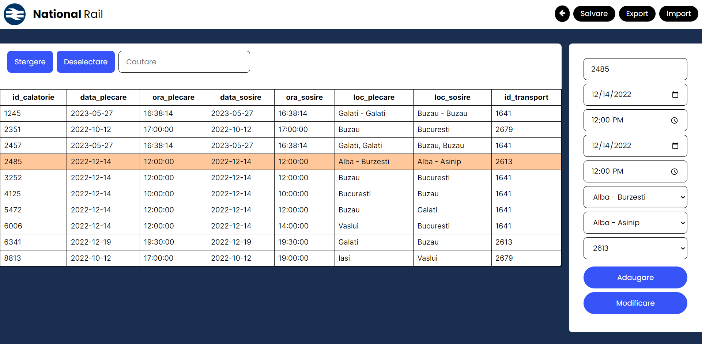

# Description
Site built using PHP, JavaScript, CSS and HTML for managing a database hosted on cloud.  
Project done for Web Applications Building class at ACIEE UGAL  

# Functionality
You can access the site at: 
[NationalRail](http://national-rail-paw.rf.gd/login.php)  
Note that the user is *admin* and the password is *nationalrail*.  
## Databases
You can manage the following databases:
- Emloyees;
- Trains;
- Transports;
- Journeys;
- Tickets;
## Management
Once you click on a database, you can edit, add and remove rows. You can also import and export excel files. After you're done you can save the changes back into the database.  

